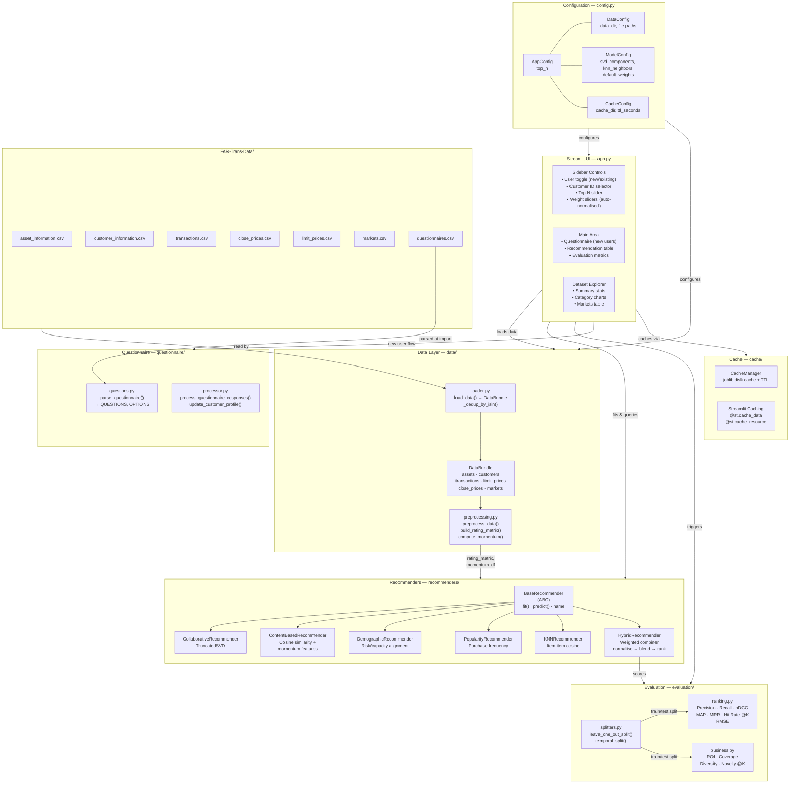
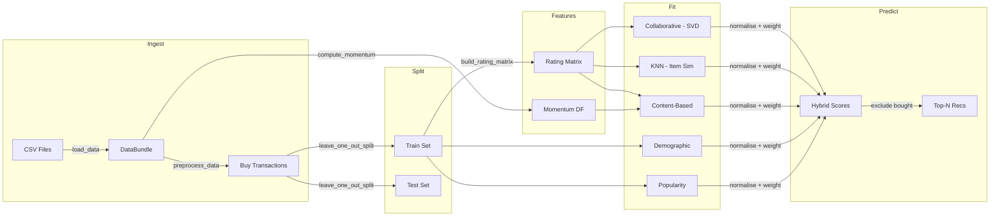
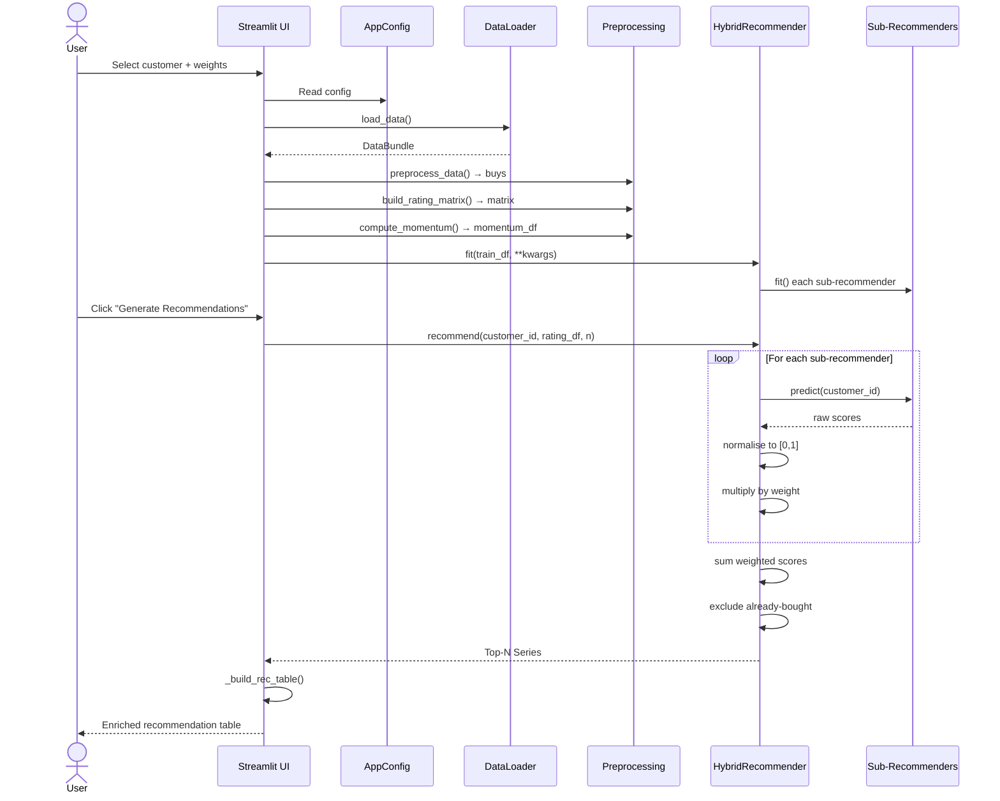
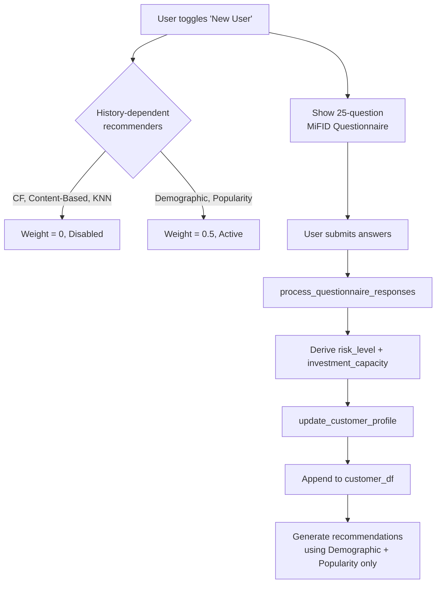
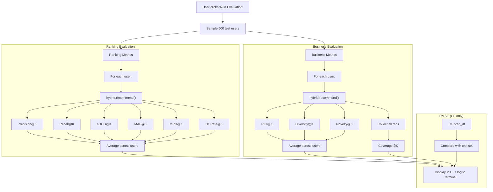
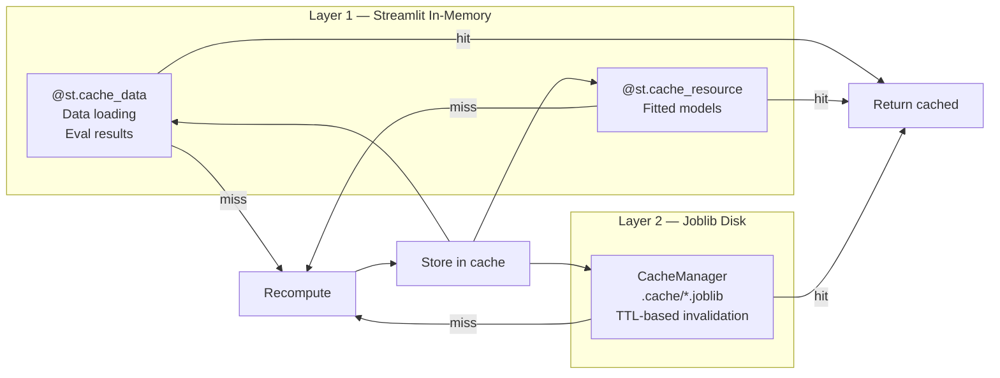
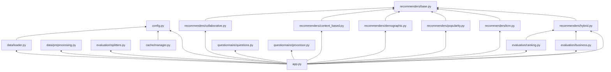

# Architecture

## System Overview

```mermaid
graph TB
    subgraph UI["Streamlit UI — app.py"]
        Sidebar["Sidebar Controls<br/>• User toggle (new/existing)<br/>• Customer ID selector<br/>• Top-N slider<br/>• Weight sliders (auto-normalised)"]
        Main["Main Area<br/>• Questionnaire (new users)<br/>• Recommendation table<br/>• Evaluation metrics"]
        Explorer["Dataset Explorer<br/>• Summary stats<br/>• Category charts<br/>• Markets table"]
    end

    subgraph Config["Configuration — config.py"]
        DC["DataConfig<br/>data_dir, file paths"]
        MC["ModelConfig<br/>svd_components, knn_neighbors,<br/>default_weights"]
        CC["CacheConfig<br/>cache_dir, ttl_seconds"]
        AC["AppConfig<br/>top_n"]
        AC --- DC
        AC --- MC
        AC --- CC
    end

    subgraph Data["Data Layer — data/"]
        Loader["loader.py<br/>load_data() → DataBundle<br/>_dedup_by_isin()"]
        Preproc["preprocessing.py<br/>preprocess_data()<br/>build_rating_matrix()<br/>compute_momentum()"]
        Bundle["DataBundle<br/>assets · customers<br/>transactions · limit_prices<br/>close_prices · markets"]
    end

    subgraph Recs["Recommenders — recommenders/"]
        Base["BaseRecommender<br/>(ABC)<br/>fit() · predict() · name"]
        CF["CollaborativeRecommender<br/>TruncatedSVD"]
        CB["ContentBasedRecommender<br/>Cosine similarity +<br/>momentum features"]
        Demo["DemographicRecommender<br/>Risk/capacity alignment"]
        Pop["PopularityRecommender<br/>Purchase frequency"]
        KNN["KNNRecommender<br/>Item-item cosine"]
        Hybrid["HybridRecommender<br/>Weighted combiner<br/>normalise → blend → rank"]

        Base --> CF
        Base --> CB
        Base --> Demo
        Base --> Pop
        Base --> KNN
        Base --> Hybrid
    end

    subgraph Eval["Evaluation — evaluation/"]
        Splitters["splitters.py<br/>leave_one_out_split()<br/>temporal_split()"]
        Ranking["ranking.py<br/>Precision · Recall · nDCG<br/>MAP · MRR · Hit Rate @K<br/>RMSE"]
        Business["business.py<br/>ROI · Coverage<br/>Diversity · Novelty @K"]
    end

    subgraph Quest["Questionnaire — questionnaire/"]
        Parser["questions.py<br/>parse_questionnaire()<br/>→ QUESTIONS, OPTIONS"]
        Processor["processor.py<br/>process_questionnaire_responses()<br/>update_customer_profile()"]
    end

    subgraph Cache["Cache — cache/"]
        CM["CacheManager<br/>joblib disk cache + TTL"]
        ST["Streamlit Caching<br/>@st.cache_data<br/>@st.cache_resource"]
    end

    subgraph Dataset["FAR-Trans-Data/"]
        CSV1["asset_information.csv"]
        CSV2["customer_information.csv"]
        CSV3["transactions.csv"]
        CSV4["close_prices.csv"]
        CSV5["limit_prices.csv"]
        CSV6["markets.csv"]
        CSV7["questionnaires.csv"]
    end

    %% Connections
    Config -->|configures| UI
    Config -->|configures| Data
    Dataset -->|read by| Loader
    Loader --> Bundle
    Bundle --> Preproc
    CSV7 -->|parsed at import| Parser

    UI -->|loads data| Data
    UI -->|fits & queries| Recs
    UI -->|triggers| Eval
    UI -->|new user flow| Quest
    UI -->|caches via| Cache

    Preproc -->|rating_matrix,<br/>momentum_df| Recs
    Hybrid -->|scores| Eval
    Splitters -->|train/test split| Ranking
    Splitters -->|train/test split| Business
```

## Data Flow

```mermaid
flowchart LR
    subgraph Ingest
        A[CSV Files] -->|load_data| B[DataBundle]
        B -->|preprocess_data| C[Buy Transactions]
    end

    subgraph Split
        C -->|leave_one_out_split| D[Train Set]
        C -->|leave_one_out_split| E[Test Set]
    end

    subgraph Features
        D -->|build_rating_matrix| F[Rating Matrix]
        B -->|compute_momentum| G[Momentum DF]
    end

    subgraph Fit
        F --> H[Collaborative - SVD]
        F --> I[KNN - Item Sim]
        F & G --> J[Content-Based]
        D --> K[Demographic]
        D --> L[Popularity]
    end

    subgraph Predict
        H & I & J & K & L -->|normalise + weight| M[Hybrid Scores]
        M -->|exclude bought| N[Top-N Recs]
    end
```

## Recommendation Pipeline

```mermaid
sequenceDiagram
    actor User
    participant UI as Streamlit UI
    participant Cfg as AppConfig
    participant DL as DataLoader
    participant PP as Preprocessing
    participant Hybrid as HybridRecommender
    participant Sub as Sub-Recommenders

    User->>UI: Select customer + weights
    UI->>Cfg: Read config
    UI->>DL: load_data()
    DL-->>UI: DataBundle

    UI->>PP: preprocess_data() → buys
    UI->>PP: build_rating_matrix() → matrix
    UI->>PP: compute_momentum() → momentum_df

    UI->>Hybrid: fit(train_df, **kwargs)
    Hybrid->>Sub: fit() each sub-recommender

    User->>UI: Click "Generate Recommendations"
    UI->>Hybrid: recommend(customer_id, rating_df, n)

    loop For each sub-recommender
        Hybrid->>Sub: predict(customer_id)
        Sub-->>Hybrid: raw scores
        Hybrid->>Hybrid: normalise to [0,1]
        Hybrid->>Hybrid: multiply by weight
    end

    Hybrid->>Hybrid: sum weighted scores
    Hybrid->>Hybrid: exclude already-bought
    Hybrid-->>UI: Top-N Series

    UI->>UI: _build_rec_table()
    UI-->>User: Enriched recommendation table
```

## New User (Cold Start) Flow

```mermaid
flowchart TD
    A[User toggles 'New User'] --> B{History-dependent<br/>recommenders}
    B -->|CF, Content-Based, KNN| C[Weight = 0, Disabled]
    B -->|Demographic, Popularity| D[Weight = 0.5, Active]

    A --> E[Show 25-question<br/>MiFID Questionnaire]
    E --> F[User submits answers]
    F --> G[process_questionnaire_responses]
    G --> H[Derive risk_level + investment_capacity]
    H --> I[update_customer_profile]
    I --> J[Append to customer_df]
    J --> K[Generate recommendations<br/>using Demographic + Popularity only]
```

## Evaluation Pipeline

```mermaid
flowchart TD
    A[User clicks 'Run Evaluation'] --> B[Sample 500 test users]

    B --> C[Ranking Metrics]
    B --> D[Business Metrics]

    subgraph Ranking ["Ranking Evaluation"]
        C --> C1["For each user:"]
        C1 --> C2["hybrid.recommend()"]
        C2 --> C3["Precision@K"]
        C2 --> C4["Recall@K"]
        C2 --> C5["nDCG@K"]
        C2 --> C6["MAP@K"]
        C2 --> C7["MRR@K"]
        C2 --> C8["Hit Rate@K"]
        C3 & C4 & C5 & C6 & C7 & C8 --> C9["Average across users"]
    end

    subgraph Biz ["Business Evaluation"]
        D --> D1["For each user:"]
        D1 --> D2["hybrid.recommend()"]
        D2 --> D3["ROI@K"]
        D2 --> D4["Diversity@K"]
        D2 --> D5["Novelty@K"]
        D3 & D4 & D5 --> D6["Average across users"]
        D2 --> D7["Collect all recs"]
        D7 --> D8["Coverage@K"]
    end

    C9 --> E[Display in UI + log to terminal]
    D6 & D8 --> E

    subgraph RMSE ["RMSE (CF only)"]
        F[CF pred_df] --> G[Compare with test set]
        G --> E
    end
```

## Caching Strategy

```mermaid
flowchart LR
    subgraph L1 ["Layer 1 — Streamlit In-Memory"]
        A["@st.cache_data<br/>Data loading<br/>Eval results"]
        B["@st.cache_resource<br/>Fitted models"]
    end

    subgraph L2 ["Layer 2 — Joblib Disk"]
        C["CacheManager<br/>.cache/*.joblib<br/>TTL-based invalidation"]
    end

    A -->|miss| D[Recompute]
    B -->|miss| D
    C -->|miss| D
    A -->|hit| E[Return cached]
    B -->|hit| E
    C -->|hit| E

    D --> F[Store in cache]
    F --> A
    F --> B
    F --> C
```

## Module Dependency Graph

```mermaid
graph BT
    config["config.py"]
    loader["data/loader.py"]
    preproc["data/preprocessing.py"]
    base["recommenders/base.py"]
    cf["recommenders/collaborative.py"]
    cb["recommenders/content_based.py"]
    demo["recommenders/demographic.py"]
    pop["recommenders/popularity.py"]
    knn["recommenders/knn.py"]
    hybrid["recommenders/hybrid.py"]
    splitters["evaluation/splitters.py"]
    ranking["evaluation/ranking.py"]
    business["evaluation/business.py"]
    cache["cache/manager.py"]
    questions["questionnaire/questions.py"]
    processor["questionnaire/processor.py"]
    app["app.py"]

    loader --> config
    cache --> config

    cf --> base
    cb --> base
    demo --> base
    pop --> base
    knn --> base
    hybrid --> base

    ranking --> hybrid
    business --> hybrid

    app --> config
    app --> loader
    app --> preproc
    app --> cf
    app --> cb
    app --> demo
    app --> pop
    app --> knn
    app --> hybrid
    app --> splitters
    app --> ranking
    app --> business
    app --> questions
    app --> processor
```
